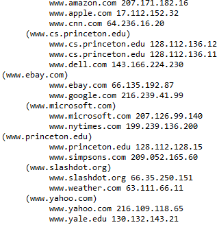

# EDA_Repositorio_Grupal_6

<html>
   <head>
      <meta content="text/html; charset=UTF-8" http-equiv="content-type">
   </head>
   <body class="c58 doc-content">
      

         

         
         <table class="c8">
            <tr class="c49">
               <td class="c53" colspan="1" rowspan="1">
                  

               </td>
               <td class="c39" colspan="1" rowspan="1">
                  
UNIVERSIDAD NACIONAL DE SAN AGUSTIN

                  
FACULTAD DE INGENIER&Iacute;A DE PRODUCCI&Oacute;N Y SERVICIOS

                  
ESCUELA PROFESIONAL DE INGENIER&Iacute;A DE SISTEMA

               </td>
               <td class="c22" colspan="1" rowspan="1">
                  

               </td>
            </tr>
            <tr class="c14">
               <td class="c50" colspan="3" rowspan="1">
                  
Formato: Gu&iacute;a de Pr&aacute;ctica de Laboratorio / Talleres / Centros de Simulaci&oacute;n

               </td>
            </tr>
            <tr class="c37">
               <td class="c53" colspan="1" rowspan="1">
                  
Aprobaci&oacute;n: &nbsp;2022/03/01

               </td>
               <td class="c39" colspan="1" rowspan="1">
                  
C&oacute;digo: GUIA-PRLE-001

               </td>
               <td class="c22" colspan="1" rowspan="1">
                  
P&aacute;gina: 

               </td>
            </tr>
         </table>
         

      

      
INFORME DE LABORATORIO

      
(formato estudiante)

      
      <table class="c8">
         <tr class="c44">
            <td class="c4" colspan="6" rowspan="1">
               
INFORMACI&Oacute;N B&Aacute;SICA

            </td>
         </tr>
         <tr class="c54">
            <td class="c18" colspan="1" rowspan="1">
               
ASIGNATURA: 

            </td>
            <td class="c42" colspan="5" rowspan="1">
               
Laboratorio - Estructura de Datos y Algoritmos

            </td>
         </tr>
         <tr class="c54">
            <td class="c18" colspan="1" rowspan="1">
               
T&Iacute;TULO DE LA PR&Aacute;CTICA: 

            </td>
            <td class="c42" colspan="5" rowspan="1">
               
&Aacute;rbol B

            </td>
         </tr>
         <tr class="c54">
            <td class="c18" colspan="1" rowspan="1">
               
N&Uacute;MERO DE PR&Aacute;CTICA:

            </td>
            <td class="c11" colspan="1" rowspan="1">
               
06

            </td>
            <td class="c1" colspan="1" rowspan="1">
               
A&Ntilde;O LECTIVO:

            </td>
            <td class="c12" colspan="1" rowspan="1">
               
2022 - A

            </td>
            <td class="c12" colspan="1" rowspan="1">
               
NRO. SEMESTRE:

            </td>
            <td class="c32" colspan="1" rowspan="1">
               
III

            </td>
         </tr>
         <tr class="c54">
            <td class="c18" colspan="1" rowspan="1">
               
FECHA DE PRESENTACI&Oacute;N

            </td>
            <td class="c11" colspan="1" rowspan="1">
               
07/08/2022

            </td>
            <td class="c1" colspan="1" rowspan="1">
               
HORA DE PRESENTACI&Oacute;N

            </td>
            <td class="c61" colspan="3" rowspan="1">
               

            </td>
         </tr>
         <tr class="c54">
            <td class="c23" colspan="4" rowspan="1">
               
INTEGRANTE (s): 

               <ul class="c16 lst-kix_list_3-0 start">
                  <li class="c2 c5 li-bullet-0">Garay Bedregal, C&eacute;sar Alejandro</li>
                  <li class="c2 c5 li-bullet-0">Chua Aguilar, Jean Carlo Leonel</li>
                  <li class="c2 c5 li-bullet-0">Cahuana Aguilar, Josu&eacute; Math&iacute;as Miguel</li>
                  <li class="c2 c5 li-bullet-0">Huisa Perez, Willy Alexander </li>
                  <li class="c2 c5 li-bullet-0">Arocutipa Gutierrez, Luis Edgar</li>
               </ul>
               

            </td>
            <td class="c12" colspan="1" rowspan="1">
               
NOTA:

            </td>
            <td class="c32" colspan="1" rowspan="1">
               

            </td>
         </tr>
         <tr class="c54">
            <td class="c27" colspan="6" rowspan="1">
               
DOCENTE(s):

               
Richart Smith Escobedo Quispe - rescobedoq@unsa.edu.pe

               

            </td>
         </tr>
      </table>
      

      
      <table class="c8">
         <tr class="c44">
            <td class="c4" colspan="1" rowspan="1">
               
SOLUCI&Oacute;N Y RESULTADOS

            </td>
         </tr>
         <tr class="c56">
            <td class="c26" colspan="1" rowspan="1">
               <ol class="c16 lst-kix_list_1-0 start" start="1">
                  <li class="c24 c36 li-bullet-1">SOLUCI&Oacute;N DE EJERCICIOS/PROBLEMAS</li>
               </ol>
               <ol class="c16 lst-kix_8ojgnsrwklqh-0 start" start="1">
                  <li class="c2 c5 li-bullet-0">Modificar el m&eacute;todo de obtenci&oacute;n de valor dado una clave</li>
               </ol>
               
Se tiene que dado una clave X, el m&eacute;todo get nos devolver&aacute; el valor de esta, por ejemplo Y ; sin embargo esto solo nos devolver&aacute; el valor de la primera clave que encuentre, debido a esto hemos tenido que modificar el c&oacute;digo del &aacute;rbol B para que dada una clave nos retorne todos los valores que est&eacute;n asociados con esta. Lo primero que se hizo fue analizar lo que ocurr&iacute;a con un &aacute;rbol B al insertar las mismas claves, eso nos llev&oacute; a la conclusi&oacute;n de que las claves repetidas solo pod&iacute;an estar como hermanos o hijos directos, as&iacute; si se buscaba por una clave Z, los dem&aacute;s resultados que tambi&eacute;n coincidian&nbsp;estar&iacute;an a la derecha o a la izquierda dentro del mismo nodo o como un hijo de estos.

               
Teniendo en cuenta esto, y sabiendo que se trabajaba con objetos, se implement&oacute; un mecanismo que guardara &nbsp;la referencia de cada clave encontrada, as&iacute; si se encontraba una clave que ya hab&iacute;a sido registrada previamente se obviaba y se pasaba a la siguiente. Para esto se agreg&oacute; un par&aacute;metro extra a la funci&oacute;n search (ArrayList) que almacenar&aacute; las mencionadas referencias e ir&aacute; comparando.

               

               

               

               

               

               
El c&oacute;digo seguir&aacute; ejecut&aacute;ndose hasta que la b&uacute;squeda sea fallida, puesto que eso significar&aacute; que ya no habr&aacute; m&aacute;s coincidencias. Finalmente el ArrayList que se retorna se imprime por medio de m&eacute;todos toString que tambi&eacute;n fueron definidos.

               

               

               

               <ol class="c16 lst-kix_8ojgnsrwklqh-0" start="2">
                  <li class="c2 c5 li-bullet-0">Mostrar en un diagrama de &aacute;rbol gr&aacute;ficamente la estructura final para los datos ingresados.</li>
               </ol>
               
Para realizar esto se us&oacute; la funci&oacute;n toString(), esta al ser llamada imprime los datos como un &aacute;rbol. La funci&oacute;n inicia recibiendo un nodo, la altura y la indentaci&oacute;n de la fila. Si la altura recibida es 0, se tratara de un nodo hoja, por lo que solo las listara usando la indentaci&oacute;n dada. Si tiene una altura distinta a 0, significa que el nodo tiene nodos hijos, en cuyo caso listara el valor del nodo recibido entre par&eacute;ntesis y luego la funci&oacute;n se llamar&aacute; a s&iacute; mismo, pero esta vez dando como nodos, los nodos hijos, la altura menos uno y una indentaci&oacute;n m&aacute;s larga. Esto se repite hasta que se haya listado todo el &aacute;rbol. Luego de realizar las acciones: 

               

               

               

               

               

               

               

               

               

               

               

               

               

               

               

               

               

               

               

               

               

               

               
y llamar a la funci&oacute;n toString(), se obtendr&aacute; lo siguiente:

               

               

               

               

               

               

               

               

               

               

               

               

               

               

               

               
&nbsp; &nbsp; &nbsp; &nbsp; &nbsp; &nbsp; &nbsp;Representado como un arbol seria: 

               

               

               
&nbsp; &nbsp; &nbsp; &nbsp;

               

               

               

               

               

               

               

               

               

               

               

               

               <ol class="c16 lst-kix_8ojgnsrwklqh-0" start="3">
                  <li class="c2 c5 li-bullet-0">El m&eacute;todo toString() del &aacute;rbol, retorna lo siguiente. &iquest;Por qu&eacute; est&aacute;n entre par&eacute;ntesis ciertas claves?</li>
               </ol>
               
Est&aacute; entre par&eacute;ntesis porque dentro del nodo es el que tiene la clave con la inicial m&aacute;s cercana a la primera letra del abecedario. Ya que a la hora de insertar una clave y su valor se ordenan de acuerdo a la clave que tenga la inicial m&aacute;s cercana a la &ldquo;a&rdquo;.

               
Mostrar paso a paso el arbol-B al eliminar &quot; <a class="c46" href="https://www.google.com/url?q=http://www.espn.com&amp;sa=D&amp;source=editors&amp;ust=1659933987985126&amp;usg=AOvVaw1dz1E2sF1AduyN5n3i2yxj">www.espn.com</a>&quot;:

               
Al ejecutar el &aacute;rbol B lo que nos aparece es:

               

               
Al eliminar la key &ldquo;<a class="c46" href="https://www.google.com/url?q=http://www.espn.com&amp;sa=D&amp;source=editors&amp;ust=1659933987985893&amp;usg=AOvVaw2pTJc6OGqhsqznvfBt_GCo">www.espn.com</a>&rdquo; los que se hace es quitarlo de el &aacute;rbol y posteriormente se procede a reordenar el &aacute;rbol quedando de la siguiente manera:

               

               <ol class="c16 lst-kix_8ojgnsrwklqh-0" start="4">
                  <li class="c2 c5 li-bullet-0">Agregar un nodo adicional (<a class="c46" href="https://www.google.com/url?q=http://www.youtube.com&amp;sa=D&amp;source=editors&amp;ust=1659933987986409&amp;usg=AOvVaw2rwPyzQ8LUtB0kEq-ZYexD">www.youtube.com</a>, 134.24.13.78) y mostrarlo paso a paso</li>
               </ol>
               

               <ul class="c16 lst-kix_eoocrxpdifo3-0 start">
                  <li class="c3 c21 c5 li-bullet-0">Primero observemos como se ve el &aacute;rbol con la inserciones anteriores:</li>
               </ul>
               

               

               

               <ul class="c16 lst-kix_o0wu14vnvn5p-0 start">
                  <li class="c3 c21 c5 li-bullet-0">Al agregar el nuevo nodo <a class="c46" href="https://www.google.com/url?q=http://www.youtube.com&amp;sa=D&amp;source=editors&amp;ust=1659933987987501&amp;usg=AOvVaw0YiIPg6E47zRxzvBs4LUwW">www.youtube.com</a>, se recorrer&aacute; el &aacute;rbol de la siguiente manera, primero tomar&aacute; el camino derecho de princeton, ya que el compareTo() del c&oacute;digo devuelve que youtube (primera letra &ldquo;y&rdquo;) &nbsp;est&aacute; m&aacute;s alejada que la &ldquo;p&rdquo; de princeton, despu&eacute;s al hacer la comparativa entre slashdot y yahoo, se detecta que el nuevo nodo est&aacute; en el grupo de yahoo, siendo incluso mayor que este y el resto de claves, por lo que se ubicar&aacute; al extremo derecho de todo el &aacute;rbol. Debemos resaltar&nbsp;que el &aacute;rbol no sufrir&aacute; ninguna rotaci&oacute;n debido a que no se supera el m&aacute;ximo de hijos por nodo, ya que es de orden 4.</li>
               </ul>
               

               

               

               

               

               

            </td>
         </tr>
         <tr class="c29">
            <td class="c26" colspan="1" rowspan="1">
               <ol class="c16 lst-kix_list_1-0" start="2">
                  <li class="c24 c36 li-bullet-1">SOLUCI&Oacute;N DEL CUESTIONARIO</li>
               </ol>
               <ul class="c16 lst-kix_list_4-0 start">
                  <li class="c2 c5 li-bullet-0">No hay cuestionario</li>
               </ul>
               

            </td>
         </tr>
         <tr class="c29">
            <td class="c26" colspan="1" rowspan="1">
               <ol class="c16 lst-kix_list_1-0" start="3">
                  <li class="c24 c36 li-bullet-1">CONCLUSIONES</li>
               </ol>
               <ul class="c16 lst-kix_list_5-0 start">
                  <li class="c2 c5 li-bullet-0">Por medio de distintas implementaciones se pudo probar lo eficiente y &uacute;til que es un &aacute;rbol B a la hora de manejar datos de cualquier tipo, tambi&eacute;n se pudo comprobar que por medio de nuevos mejoramientos en el c&oacute;digo se puede hacer de esta estructura una mucho mejor. </li>
                  <li class="c2 c5 li-bullet-0">Los &aacute;rboles B al estar generalmente aplicados a bases de datos, son muy eficaces para almacenar informaci&oacute;n de este tipo en diferentes nodos, como ya hemos podido apreciar en este ejercicio, el auto balance del &aacute;rbol permite encontrar y mostrar los datos de un nodo espec&iacute;fico con gran efectividad.</li>
               </ul>
               

            </td>
         </tr>
      </table>
      

      
      <table class="c8">
         <tr class="c44">
            <td class="c4" colspan="1" rowspan="1">
               
RETROALIMENTACI&Oacute;N GENERAL

            </td>
         </tr>
         <tr class="c29">
            <td class="c26" colspan="1" rowspan="1">
               

               

            </td>
         </tr>
      </table>
      

      
      <table class="c8">
         <tr class="c44">
            <td class="c4" colspan="1" rowspan="1">
               
REFERENCIAS Y BIBLIOGRAF&Iacute;A

            </td>
         </tr>
         <tr class="c57">
            <td class="c26" colspan="1" rowspan="1">
               

            </td>
         </tr>
      </table>
      

      

   </body>
</html>